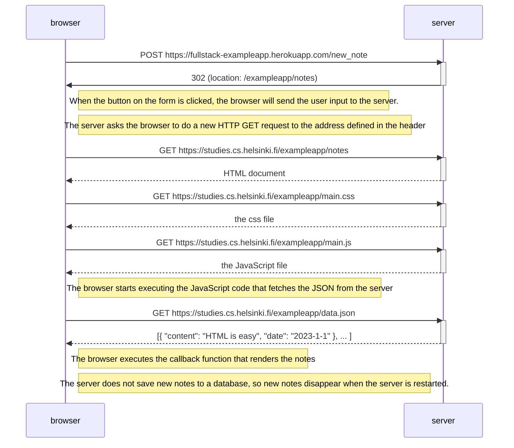
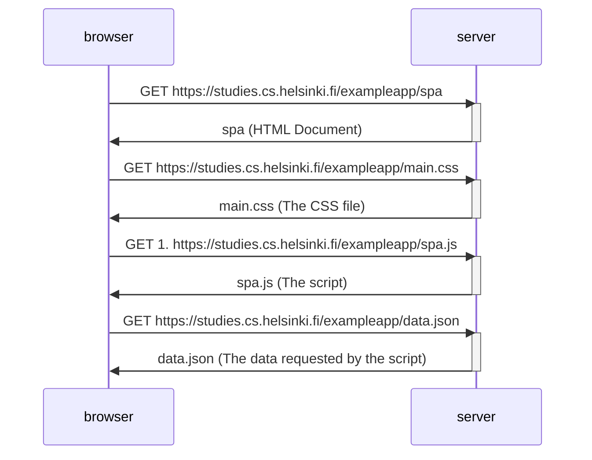
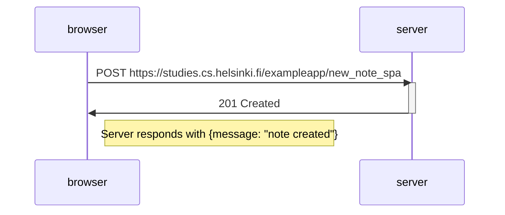

# Part 0

## b

### Exercise 0.4: New Diagram

```mermaid
sequenceDiagram
	participant browser
	participant server

	browser->>server: POST https://fullstack-exampleapp.herokuapp.com/new_note
	activate server
	server->>browser: 302 (location: /exampleapp/notes)
	deactivate server

	Note right of browser: When the button on the form is clicked, the browser will send the user input to the server.
	
	Note right of browser: The server asks the browser to do a new HTTP GET request to the address defined in the header

    browser->>server: GET https://studies.cs.helsinki.fi/exampleapp/notes
    activate server
    server-->>browser: HTML document
    deactivate server


    browser->>server: GET https://studies.cs.helsinki.fi/exampleapp/main.css
    activate server
    server-->>browser: the css file
    deactivate server

    browser->>server: GET https://studies.cs.helsinki.fi/exampleapp/main.js
    activate server
    server-->>browser: the JavaScript file
    deactivate server

    Note right of browser: The browser starts executing the JavaScript code that fetches the JSON from the server

    browser->>server: GET https://studies.cs.helsinki.fi/exampleapp/data.json
    activate server
    server-->>browser: [{ "content": "HTML is easy", "date": "2023-1-1" }, ... ]
    deactivate server

    Note right of browser: The browser executes the callback function that renders the notes
	
    Note right of browser: The server does not save new notes to a database, so new notes disappear when the server is restarted.
	
```

### Exercise 0.5: Single page app diagram

```mermaid
sequenceDiagram

participant browser
participant server

browser->>server: GET https://studies.cs.helsinki.fi/exampleapp/spa
activate server
server->>browser: spa (HTML Document)
deactivate server

browser->>server: GET https://studies.cs.helsinki.fi/exampleapp/main.css
activate server
server->>browser: main.css (The CSS file)
deactivate server


browser->>server: GET 1. https://studies.cs.helsinki.fi/exampleapp/spa.js
activate server
server->>browser: spa.js (The script)
deactivate server

browser->>server: GET https://studies.cs.helsinki.fi/exampleapp/data.json
activate server
server->>browser: data.json (The data requested by the script)
deactivate server

```

### Exercise 0.6: New note in single page app diagram

```mermaid
sequenceDiagram

participant browser
participant server

browser->>server: POST https://studies.cs.helsinki.fi/exampleapp/new_note_spa
activate server
server->>browser: 201 Created
deactivate server

Note right of browser: Server responds with {message: "note created"}

```